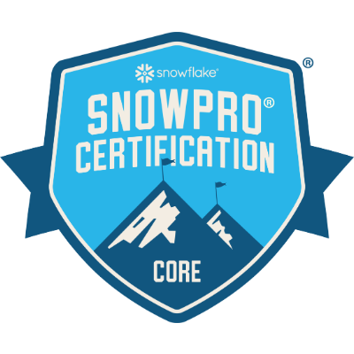
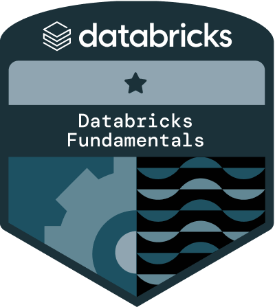

# 👋 Hi, I'm Bharadwaj Bairi

🚀 **AWS Certified Data Engineer | 3+ Years Experience**  
🌎 Based in Maryville, MO | 📫 [bharadwajbairi3@gmail.com](mailto:bharadwajbairi3@gmail.com)

  
  
  

## 🧠 About Me

Cloud-native Data Engineer with hands-on experience designing scalable, high-throughput ETL pipelines using AWS, GCP, Spark, and Kafka. I build cost-efficient solutions that support real-time analytics and data-driven decisions.

## 🛠️ Skills

- **Languages**: Python, SQL, PySpark, NoSQL  
- **Databases & Warehousing**: Snowflake, Amazon Redshift, BigQuery, PostgreSQL  
- **Cloud Platforms**: AWS (Glue, Lambda, S3, Kinesis, Athena), GCP (BigQuery, Cloud Composer, GCS)  
- **Orchestration & Streaming**: Apache Airflow, Kafka, Spark Streaming  
- **Containers & DevOps**: Docker, Kubernetes, Git, Jenkins 
- **Visualization**: Amazon QuickSight, Tableau  
- **Methodologies**: Agile, Scrum

## 💼 Experience

**Data Engineer** | SAAS Tech, NJ, USA  
*Jan 2024 – Present*  
- Designed optimized Glue + Spark pipelines (30% faster)  
- Automated S3 ↔ Snowflake sync via Airflow + Lambda  
- Built real-time pipelines with Kafka, Kinesis, and CloudWatch  
- Containerized apps deployed on ECS Fargate  
- Improved Snowflake compute costs by 25%

**Data Engineer** | Mayo Clinic, India  
*May 2022 – Dec 2023*  
- Built 20+ ETL pipelines using Python, Glue, BigQuery  
- Migrated legacy systems from Oracle to BigQuery/Redshift  
- Processed 10 TB/day using Glue + Spark  
- Built QuickSight dashboards with CI/CD using Jenkins + Terraform

**Data Analyst Intern** | Vak Tech INC  
*Mar 2021 – Mar 2022*  
- Automated data validation using SQL + Excel  
- Reduced query time by 30%; improved dataset reliability

## 🚀 Projects

### 🎧 [Spotify_ETL](https://github.com/bharadwajbairi3/Spotify_ETL)  
**Stack**: AWS Glue, S3, Athena, QuickSight  
This project demonstrates a complete end-to-end ETL pipeline for processing music metadata using AWS services. It integrates multiple datasets — artists, albums, and tracks — and transforms them into an analytics-ready format for querying and visualization.

### 🎓 [AWS Student Data Pipeline](https://github.com/bharadwajbairi3/aws-student-data-pipeline)  
**Stack**: AWS Lambda, S3, Glue, Athena, CloudWatch, EventBridge, SNS, EC2, DynamoDB  
An end-to-end serverless data pipeline that collects, stores, transforms, and analyzes student academic data using AWS services like EC2, DynamoDB, Lambda, S3, Glue, and Athena.

## 📜 Certifications

### 🏅 AWS Certified Data Engineer – Associate (July 2025)

  

### ❄️ Snowflake SnowPro Core Certification (July 2025)

  

## 📄 [Download My Resume](Bharadwaj_DataEngineer_Resume.pdf)

## 📫 Contact Me

- 📧 [bharadwajbairi3@gmail.com](mailto:bharadwajbairi3@gmail.com)  
- 🔗 [LinkedIn](https://linkedin.com/in/bharadwajbairi)  

*Thanks for stopping by! Feel free to connect or collaborate.*
